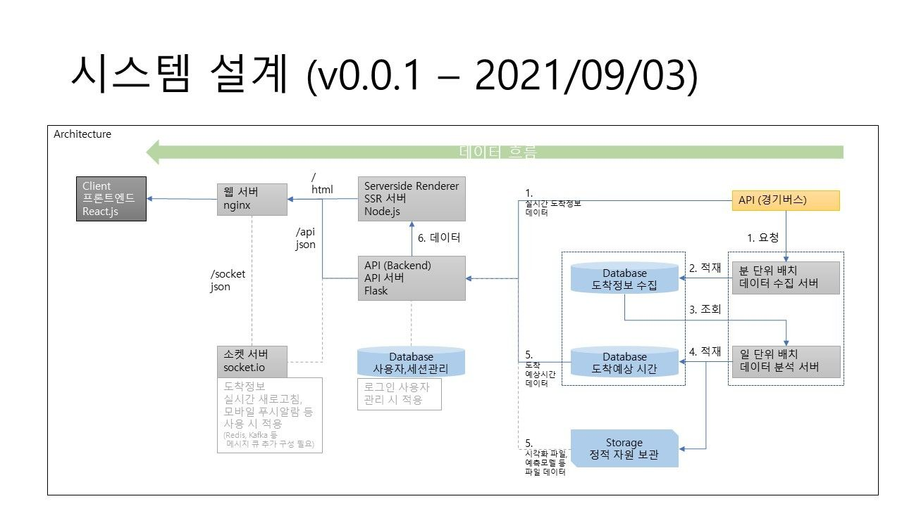

# GOMATA (고양시 마을버스 타요)

# 0. recent version: `0.0.1` `@2021-09-19`
## 업데이트 내역
   1. 프론트엔드 페이지 초안이 작성되었습니다.
   2. 백엔드 API 서버 도커 이미지가 작성되었습니다.
   3. 프론트엔드 SSR 서버 (개발) 도커 이미지가 작성되었습니다.
   4. nginx 웹서버 도커 이미지가 작성되었습니다.

# 1. About This Project
   1. 목표 : 우리 동네 마을 버스 언제 와?
   2. Github : https://github.com/devhoonse/bus_project
   3. Jira : https://devhoonse.atlassian.net/jira/software/projects/BUS/boards/1/roadmap

# 2. Contact Us
   1. `jangwy8838@gmail.com` `PM/PL`
   2. `tnstndusqlc@gmail.com` `DGN`
   3. `devhoonse@gmail.com` `DEV`

# 3. How to Run Test
   ## 0) 전체 서비스 한 번에 기동하기
   - ### 전체 서비스 구성도
     
   - ### 서비스 사용 테스트
     1. 프론트엔드 : http://localhost
     2. API 서버 : http://localhost/api
        1. 동작 확인 : http://localhost/api/arrival?station_id=where_is_it&bus_id=which_bus
     3. API 문서 : http://localhost/api/doc
   - ### 프로젝트 내려받기
        > git clone https://github.com/devhoonse/bus_project.git;
   - ### 모든 도커 이미지 빌드하기 `약 1~2 분 소요`
      > cd nginx; docker build . -t nginx:0.01; \
        cd ..; \
        cd frontend; docker build . -t frontend-dev:0.01 -f Dockerfile-dev; \
        cd ..; \
        cd api; docker build . -t api:0.01; \
        cd ..;
   - ### sudo 권한 필요한 경우 (리눅스 환경)
     > cd nginx; sudo docker build . -t nginx:0.01; \
       cd ..; \
       cd frontend; sudo docker build . -t frontend-dev:0.01 -f Dockerfile-dev; \
       cd ..; \
       cd api; sudo docker build . -t api:0.01; \
       cd ..;
   - ### 모든 서비스 기동 (도커 이미지)
     > docker-compose up -d; \
       docker ps;  # 컨테이너 기동 상태 확인하기
   - ### 모든 서비스 종료
     > docker-compose stop; \
       docker ps;  # 컨테이너 종료 상태 확인하기
   
   ## 1) 웹 서버 (nginx)
   - ### 접속 확인 
     - http://localhost (아래 각 서비스들을 기동해야 해당 페이지가 나타납니다.)
   - ### 서버 구동 (도커 이미지)
      > cd nginx; \
        docker build . -t nginx:0.01; \
        docker-compose up -d nginx;
   - ### 서버 종료
     > docker-compose stop nginx;
   
   ## 2) Serverside Renderer (Node.js)
   - ### 개발 페이지 확인 : http://localhost:3030
   - ### 서비스 포트 변경 
     1. docker-compose.yml 의 ports 설정의 3030 부분 변경
   - ### 개발 서버 구동 (도커 이미지)
      > cd frontend; \
        docker build . -t frontend-dev:0.01 -f Dockerfile-dev; \
        docker-compose up -d frontend-dev;
   - ### 서버 종료
      > docker-compose stop frontend-dev;
    
   ## 3) API Server (Flask)
   - ### API 문서(swagger) : http://localhost:8099/api/doc 
   - ### 서비스 포트 변경 
     1. docker-compose.yml 의 ports 설정의 8099 부분 변경 
   - ### 서버 구동 (도커 이미지)
      > cd api; \
        docker build . -t api:0.01; \
        docker-compose up -d api;
   - ### 서버 종료
     > docker-compose stop api;
   
## 4) Date colletion 
 - ### 샘플 데이터를 사용
     > cd api/static/data_collection; \
     > tar -zxvf sample.tar.gz; \
     > data, ref 폴더 생성

## 5. Production Deployment `작성 중`
> docker-compose up -d;
